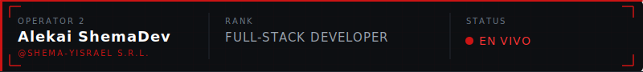
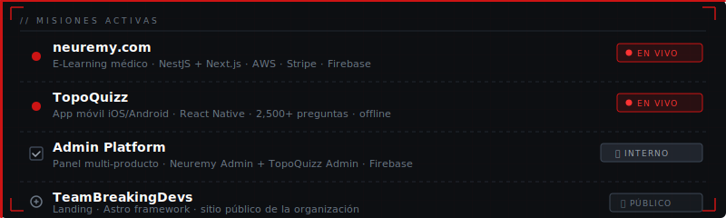

<!-- ALEXSHEMADEV — GITHUB PROFILE -->

 

## `> INTEL`

> Construyendo plataformas e-learning, apps móviles y paneles administrativos.
> Stack: **NestJS · Next.js · React Native · Prisma · AWS · Firebase · Stripe**

---

## `> STATS`

 

---

## `> ACTIVIDAD`

---

## `> ARSENAL TÉCNICO`

---

## `> MISIONES ACTIVAS`

---

`neuremy.com · topoquizz.com — EN VIVO`

